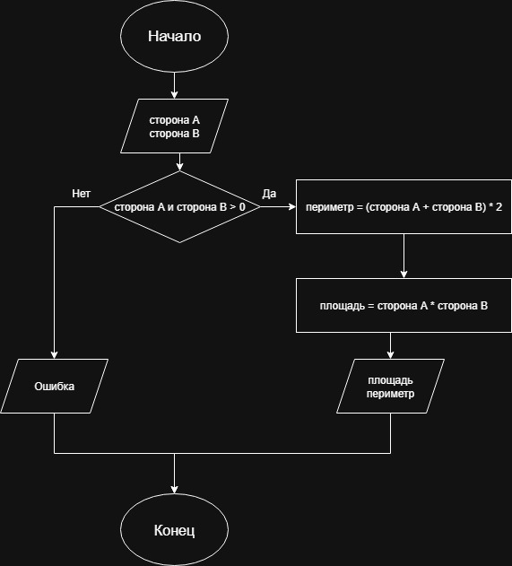

# Домашнее задание к работе 3

## Условие задачи
Написать и отладить программу, вычисления площади и периметра прямоугольника со сторонами A и B, указанными пользователем
---
## 1. Алгоритм и блок схема

### Алгоритм
1. **Начало**
2. Объявить переменные:
   - `aSide` - сторона А
   - `bSide` - сторона B
   - `perimetr` - периметр
   - `square` - площадь 
3. Запросить значения сторон у пользователя.
4. Проверить стороны на положительность, иначе вывести оповещение об ошибке и перейти на пункт 7.
5. Вычислить периметр и площадь:
   - perimetr = (aSide + bSide) * 2
   - square = aSide * bSide
6. Вывести результаты вычислений.
7. **Конец**

### Блок-схема


 [Ссылка на блок-схему](https://viewer.diagrams.net/?tags=%7B%7D&lightbox=1&highlight=0000ff&edit=_blank&layers=1&nav=1&title=%D0%94%D0%B8%D0%B0%D0%B3%D1%80%D0%B0%D0%BC%D0%BC%D0%B0%20%D0%B1%D0%B5%D0%B7%20%D0%BD%D0%B0%D0%B7%D0%B2%D0%B0%D0%BD%D0%B8%D1%8F.drawio&dark=auto#Uhttps%3A%2F%2Fdrive.google.com%2Fuc%3Fid%3D1JE9sQFAiP4rrBna6plOgZQKffOCHrX-w%26export%3Ddownload)

 ## 2. Реализация программы

```c
#include <stdio.h>
#include <locale.h>

int main()
{
	float aSide;
	float bSide;
	float perimetr;
	float square;

	setlocale(LC_ALL, "RUS");
	puts("Введите сторону А...");
	scanf("%f", &aSide);
	puts("Введите сторону В...");
	scanf("%f", &bSide);
	if(aSide < 0 || bSide < 0)
	{
		puts("Значения сторон должны быть положительными");
		return 0;
	}
	perimetr = (aSide + bSide) * 2;
	square = aSide * bSide;

	printf("У прямоугольника со сторонами %g и %g:\n", aSide, bSide);
	printf("Периметр равен (%0.1f + %0.1f) * 2 = %0.1f\n", aSide, bSide, perimetr);
	printf("Площадь равна %0.1f * %0.1f = %0.1f\n", aSide, bSide, square);

	return 0;
}
```
# 3. Результаты работы программы
Введите сторону А...

5

Введите сторону В...

6

У прямоугольника со сторонами 5 и 6:

Периметр равен (5,0 + 6,0) * 2 = 22,0

Площадь равна 5,0 * 6,0 = 30,0

H:\source\HomeTask3\x64\Debug\HomeTask3.exe (процесс 23308) завершил работу с кодом 0 (0x0).
# 4. Информация о разработчике
Авраменко Дмитрий бИПТ-251
